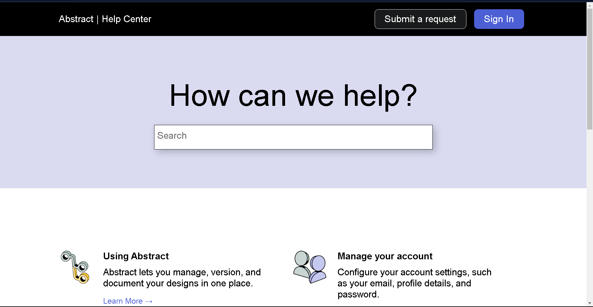

# FrontendPractice-Abstract

Hello Everyone, This is my second practice project and all materials owned by companies and individuals whose website is featured on https://www.frontendpractice.com/ are meant for practice purposes only.

### Desktop View

### Live Site
https://help.abstract.com/hc/en-us

### Links:

* Template: https://www.frontendpractice.com/projects/abstract
* Code: https://github.com/Utkarsh3128/FrontendPractice-Abstract.git

### Built with
* HTML
* CSS

### Useful Resources

- .[CSS Tricks](https://css-tricks.com/): Very useful whenever got stuck while styling
- .[w3schools](https://www.w3schools.com/): Very helpful for learning Web Programming basics

### Frontend Practice - Abstract Help Page solution
